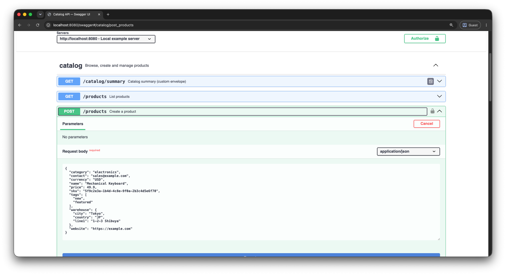
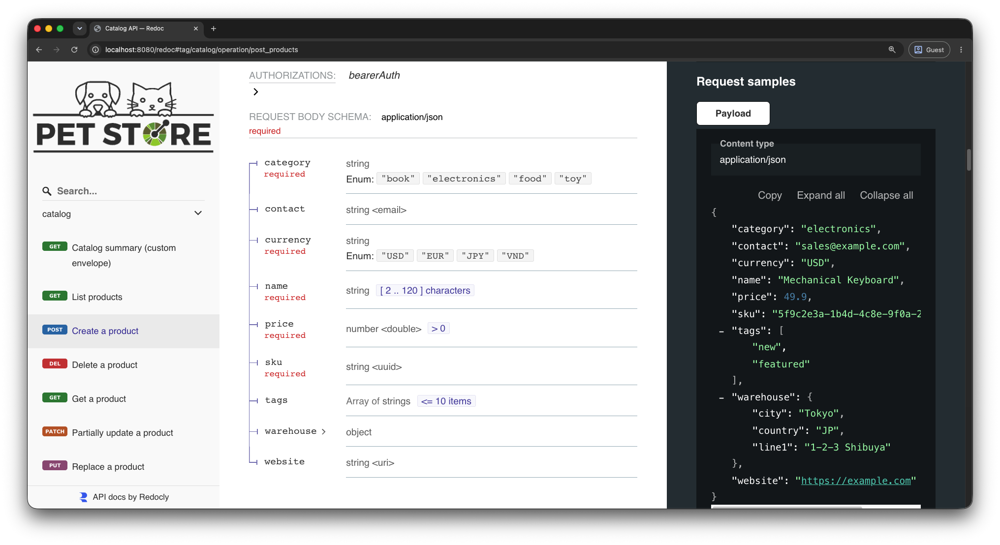

# oapi

Turn typed Go handlers into HTTP endpoints whose request and response structs are
the single source of truth for **binding**, **validation** and **OpenAPI 3 docs**.

The struct tags you already write to bind and validate a request are the same tags
the OpenAPI generator reads, so the docs are generated from the exact Go types the
handler binds — they **can never drift** from the running code.

[](https://pkg.go.dev/github.com/antlss/oapi)
[](https://go.dev/)
[](LICENSE)

> Status: **pre-1.0** — the API may still change before a tagged `v1`.

<p align="center">
  
  
</p>
<p align="center"><sub>OpenAPI docs generated straight from the Go types — Swagger UI (left) and Redoc (right). Run it yourself from <a href="examples/"><code>examples/</code></a>.</sub></p>

## Features

- **Typed handlers** — `func(ctx, Request[Header, Param, Query, Body]) (*Response, error)`; each part binds from a different source, `struct{}` for the parts you don't use.
- **Typed middleware** — `WithTypedBefore` sees the same parsed request as the handler (parsed once, shared).
- **Five adapters, one route set** — the same `[]Route` runs unchanged on **net/http**, **gin**, **Fiber v2**, **chi** and **Echo v4**.
- **OpenAPI 3 generation** — a `Registry` turns the routes into a validated spec (`JSON`/`YAML`/`Write`) from the same struct tags used for binding.
- **Pluggable seams** — the validator, response envelope and error parser are swappable interfaces; the core ships none and depends on no validation library.
- **Scoped config** — bundle validator/envelope/error-parser/body-cap into an immutable `App` and attach it per route with `WithApp`, instead of process-wide globals.
- **Files** — multipart uploads (`[]*multipart.FileHeader`) bind like any field; downloads stream via `NewResult(bytes).WithFile(...)`.
- **Envelopes & paging** — default `{"data": ...}` (+ `meta`), with per-route custom or raw responses.
- **Safe errors** — `HTTPError`, per-route `ErrorMapper`, process-wide `ErrorParser`; unrecognised errors render a generic 500 and never leak internals.

## Install

```sh
go get github.com/antlss/oapi
```

The net/http adapter ships with the core. Each other adapter is its own module, so
you pull in only what you import:

```sh
go get github.com/antlss/oapi/adapter/gin
go get github.com/antlss/oapi/adapter/fiber
go get github.com/antlss/oapi/adapter/chi
go get github.com/antlss/oapi/adapter/echo
```

Validation is opt-in (the core ships no validator). Copy the go-playground/validator
reference in `examples/validation`, or implement the small [`Validator`](#validation)
interface yourself.

## Quickstart

A complete net/http service: one typed route, plus the OpenAPI document at
`/openapi.json`.

```go
package main

import (
	"context"
	"log"
	"net/http"

	"github.com/antlss/oapi"
	nethttp "github.com/antlss/oapi/adapter/nethttp"
)

// One struct drives everything: `json` binds the body, `binding` validates it AND
// becomes the OpenAPI schema (required/enum/bounds), `example` sets the docs samples.
type CreateProductBody struct {
	Name     string  `json:"name"     binding:"required,min=2,max=120"     example:"Mechanical Keyboard"`
	Price    float64 `json:"price"    binding:"required,gt=0"              example:"49.90"`
	Currency string  `json:"currency" binding:"required,oneof=USD EUR JPY" example:"USD"`
}

type Product struct {
	ID       int     `json:"id"       example:"1001"`
	Name     string  `json:"name"     example:"Mechanical Keyboard"`
	Price    float64 `json:"price"    example:"49.90"`
	Currency string  `json:"currency" example:"USD"`
}

// Header/Param/Query are unused, so struct{}. Returning *Product wraps it in the
// default {"data": ...} envelope; Response is inferred from the return type.
var CreateProduct = oapi.NewRoute(
	http.MethodPost, "/products",
	func(_ context.Context, req oapi.Request[struct{}, struct{}, struct{}, CreateProductBody]) (*Product, error) {
		return &Product{ID: 1001, Name: req.Body.Name, Price: req.Body.Price, Currency: req.Body.Currency}, nil
	},
	oapi.WithSummary("Create a product"),
	oapi.WithTags("catalog"),
	oapi.WithSuccessStatus(http.StatusCreated),
)

func main() {
	mux := http.NewServeMux()
	nethttp.RegisterAll(mux, CreateProduct)

	// Build the spec from the SAME routes and serve it.
	reg := oapi.NewRegistry("Catalog API", "v1").
		Describe("A tiny example API.").
		AddServer("http://localhost:8080", "Local").
		Add(CreateProduct)
	mux.HandleFunc("GET /openapi.json", nethttp.SpecHandler(reg))

	log.Println("listening on :8080  (spec at /openapi.json)")
	log.Fatal(http.ListenAndServe(":8080", mux))
}
```

`POST /products` binds the body, returns `201` with `{"data": {...}}`, and
`/openapi.json` serves a spec whose schema — required fields, the `oneof` enum, the
bounds — comes from the same struct.

> Validation is opt-in: install a validator once at startup —
> `oapi.SetValidator(validation.New())` — or the `binding` rules are skipped (with a
> one-time warning).

### Browse the docs — Swagger UI & Redoc

`/openapi.json` is the raw spec. To make it browsable, serve a tiny HTML page that
loads that spec into **Swagger UI** (interactive "Try it out") or **Redoc**
(read-only reference) from a CDN — no extra Go dependency, no embedded assets:

```go
const swaggerHTML = `<!DOCTYPE html><html><head><meta charset="utf-8">
<title>Catalog API — Swagger UI</title>
<link rel="stylesheet" href="https://cdn.jsdelivr.net/npm/swagger-ui-dist@5/swagger-ui.css"></head>
<body><div id="swagger-ui"></div>
<script src="https://cdn.jsdelivr.net/npm/swagger-ui-dist@5/swagger-ui-bundle.js"></script>
<script>window.onload = () => SwaggerUIBundle({url: "/openapi.json", dom_id: "#swagger-ui"})</script>
</body></html>`

const redocHTML = `<!DOCTYPE html><html><head><meta charset="utf-8">
<title>Catalog API — Redoc</title></head>
<body><redoc spec-url="/openapi.json"></redoc>
<script src="https://cdn.jsdelivr.net/npm/redoc@2/bundles/redoc.standalone.js"></script>
</body></html>`

func htmlPage(html string) http.HandlerFunc {
	return func(w http.ResponseWriter, _ *http.Request) {
		w.Header().Set("Content-Type", "text/html; charset=utf-8")
		_, _ = w.Write([]byte(html))
	}
}
```

Mount them next to the spec in `main`. The UIs are plain static HTML, so there's
nothing `oapi`-specific here — serve the strings with whatever your framework uses
for an HTML route:

```go
mux.HandleFunc("GET /openapi.json", nethttp.SpecHandler(reg)) // the spec (from above)
mux.HandleFunc("GET /swagger", htmlPage(swaggerHTML))         // interactive UI
mux.HandleFunc("GET /redoc", htmlPage(redocHTML))             // reference docs
```

Open `http://localhost:8080/swagger` or `/redoc`. Both pages only point at
`/openapi.json`, so they track the Go types automatically — change a struct, the
docs change with it.

> `examples/docsui` ships these same pages with **pinned versions + SRI integrity
> hashes** and a landing page at `/`. Copy that package as-is for production rather
> than the floating `@5`/`@2` tags shown here.

## Adapters

The core is framework-agnostic. Every adapter exposes the same surface — `Register`,
`RegisterAll`, `SpecHandler` — so switching frameworks is just a different
`RegisterAll` call over the same routes.

| Framework | Adapter package (under `github.com/antlss/oapi`) | Notes |
| --------- | ------------------------------------------------ | ----- |
| net/http  | `adapter/nethttp` | Ships with the core, no extra deps (Go 1.22+ method-aware `ServeMux`). |
| gin       | `adapter/gin`     | Separate module. |
| Fiber v2  | `adapter/fiber`   | Separate module. |
| chi       | `adapter/chi`     | Separate module (go-chi/chi v5). |
| Echo v4   | `adapter/echo`    | Separate module. |

Each adapter caps the request body at `DefaultMaxRequestBytes` (10 MiB; set `0` to
disable), overridable per route via an `App`'s `WithMaxRequestBytes`.

## OpenAPI generation

A `Registry` collects routes and document metadata, then renders the spec:

```go
reg := oapi.NewRegistry("Catalog API", "v1").
	Describe("...").
	Contact("API Team", "https://example.com/support", "api@example.com").
	License("Apache-2.0", "https://www.apache.org/licenses/LICENSE-2.0").
	AddServer("https://api.example.com", "Production").
	AddSecurityScheme("bearerAuth", oapi.BearerAuth()).
	AddTag("catalog", "Browse and manage products").
	Add(routes...)

data, err := reg.JSON() // or reg.YAML()
err = reg.Validate(ctx) // check against the OpenAPI 3 schema
```

Also available: `TermsOfService`, `ExternalDocs`, `Logo`/`LogoWith`, `TagGroup`, and
`UseComponents()` (emit shared types as `$ref` under `components/schemas` instead of
inlining). A `Base` document supplies defaults the generated paths overlay (`Base` /
`LoadBaseFile`).

**Write the spec to disk.** `Write` validates first (unless `NoValidate`), then
emits JSON and/or YAML, returning the paths it wrote:

```go
written, err := reg.Write(ctx, oapi.GenConfig{Dir: "openapi"})
// -> ["openapi/openapi.json", "openapi/openapi.yaml"], validated before writing
```

**Generate it as a CLI / `go generate` step.** `tools/gen_doc` is a turnkey `main`
that parses flags, validates and writes — so your generator command is one line.
Drop a `//go:generate` directive next to your routes and the spec is rebuilt with
`go generate`:

```go
//go:generate go run ./cmd/openapi-gen -out ./openapi
package main

import (
	gendoc "github.com/antlss/oapi/tools/gen_doc"
	"example.com/app/api"
)

func main() { gendoc.Main(api.Registry()) } // flags: -out -format json,yaml -base FILE -no-validate
```

**See it generate, end to end.** The `examples/` module ships exactly this wiring —
a real `cmd/openapi-gen`, a `//go:generate` directive in `api/routes.go`, and the
committed output under `examples/openapi/`. Run it yourself:

```sh
cd examples
go run ./cmd/openapi-gen -out ./openapi   # validates, then writes openapi/openapi.{json,yaml}
go generate ./...                         # the same, via the //go:generate directive
```

Because the output is committed, regenerating and diffing it in review is how spec
drift is caught: change a struct, rerun, and the JSON/YAML change with it — or the
diff tells you a doc went stale.

## Concepts

### Request parts

`Request[Header, Param, Query, Body]` — each part binds from a different source;
`struct{}` means "this endpoint doesn't use it":

| Part     | Source                 | Tag |
| -------- | ---------------------- | --- |
| `Header` | request headers        | `header:"..."` |
| `Param`  | path parameters        | `uri:"..."` |
| `Query`  | query string           | `form:"..."` |
| `Body`   | JSON body              | `json:"..."` |
| `Body`   | urlencoded / multipart | `form:"..."` (+ `[]*multipart.FileHeader` for files) |

The `binding` tag carries validation rules that also become OpenAPI constraints
(`required`; `oneof`→enum; `min`/`max`/`gt`→bounds; `uuid`/`email`/`url`→formats).
`example` tags set the docs samples.

### Constructors

- `NewRoute` — handler returns `*Response`, wrapped by the envelope; `nil` → `204 No Content`.
- `NewRichRoute` — handler returns a fully built `*Result` (paging, headers, status, file download). Add `WithResponseType[T]()` or `WithBinaryResponse(...)` so the docs match what it returns.
- `NewBodyRoute` / `NewQueryRoute` / `NewParamRoute` — shortcuts for single-part endpoints, so you skip the `struct{}` placeholders.

### Result & envelope

- Build a `*Result` with `NewDataResult` (enveloped), `NewListDataResult` (+ paging meta) or `NewResult` (raw); chain `.WithStatus`, `.WithHeader`, `.WithMeta`, `.WithPaging`, `.WithFile`.
- The envelope is a `ResponseEnvelope` seam (default `DataEnvelope` → `{"data": ...}`). Override per route with `WithEnvelope(KeyedEnvelope{...})` / `WithRawResponse()`, per `App` with `WithResponseEnvelope`, or globally with `SetResponseEnvelope`. One definition drives both the wire body and its documented schema.

### Errors

- `HTTPError` — any error with `HTTPStatus() int` controls its own status (and, via `ErrorBody`, its JSON). Build one with `oapi.NewError(...)`, or the standard field-level 400 with `oapi.NewValidationError(...)`.
- `ErrorMapper` (per-route, `WithErrorMapper`) and `ErrorParser` (global, `SetErrorParser`) own the full wire body; `ErrorParser` also documents it.
- Resolution order: per-route mapper → `ErrorParser` → `HTTPError` → aerror-shaped duck typing → generic 500. Unrecognised errors never leak; they're recorded on the carrier for logging middleware.

### Validation

Validation is a pluggable seam — the core ships **no** validator and depends on no
validation library, so you choose one (or none) and pull in only what you import.

```go
// Install once at startup, before serving. The binding rules now run on every request.
oapi.SetValidator(validation.New())
```

- **The seam.** Any type implementing `Validator` (`Validate(value any, source string) error`)
  works. Install it process-wide with `SetValidator`, or scope it to a route group with
  an `App`'s `WithValidator`. `SetValidator(nil)` disables it explicitly.
- **If you skip it.** With no validator installed, the `binding` rules are *not*
  enforced — requests bind and pass through, and the library logs a one-time warning.
  Schema generation is unaffected: the docs still show the constraints either way.
- **One tag, two jobs.** `RuleTag` (default `"binding"`) names the tag the validator
  reads *and* the generator turns into OpenAPI constraints, so a rule like
  `binding:"required,oneof=USD EUR"` can never validate one thing and document another.
- **Reference implementation.** `examples/validation` is a ready go-playground/validator
  adapter (`validation.New()`): one engine per request part, field errors reported by
  their wire name (`json`/`header`/`uri`/`form`), translated into the library's
  field-level `400`. Copy it, or implement the one-method seam yourself.

Each runnable example installs it at startup (`oapi.SetValidator(validation.New())`),
so a request that violates a `binding` rule comes back as a structured `400` you can
see in Swagger UI.

### Scoped config (App)

Instead of process-wide globals, bundle config into an immutable `App` and attach it
per route — two differently configured groups can then serve in one process:

```go
app := oapi.New(
	oapi.WithValidator(validation.New()),
	oapi.WithResponseEnvelope(oapi.KeyedEnvelope{DataKey: "data", Constants: map[string]any{"success": true}}),
	oapi.WithErrorParser(api.AppErrorParser{}),
	oapi.WithMaxRequestBytes(5 << 20),
)
r := oapi.NewRoute(method, path, handler, oapi.WithApp(app))
```

`New` snapshots the current globals and is immutable after. The App scopes both the
wire bytes and the generated docs, so `/v1` and `/v2` can each have their own
envelope and error shape with no global state. (`RuleTag` stays process-wide.)

## Examples

`examples/` is a runnable "Catalog API" exercising every capability — all request
parts, JSON/urlencoded/multipart bodies, file upload/download, paging, security,
typed middleware, the full error model and custom envelopes. The same routes mount
on net/http, gin and Fiber under `examples/cmd/{nethttp,gin,fiber}`.
`examples/cmd/customized` configures the response/error shapes process-wide via
`Set*`; `examples/cmd/scoped` does it per `App` (two groups, no globals).

Every command serves the spec at `/openapi.json` plus **Swagger UI** (`/swagger`),
**Redoc** (`/redoc`) and a landing page (`/`) — the ready-made pages in
`examples/docsui` (CDN-loaded, version-pinned, SRI-hashed). Run one and open the
root URL:

```sh
cd examples && go run ./cmd/nethttp   # then open http://localhost:8081
```

## License

[MIT](LICENSE) © 2026 Tran Long An
